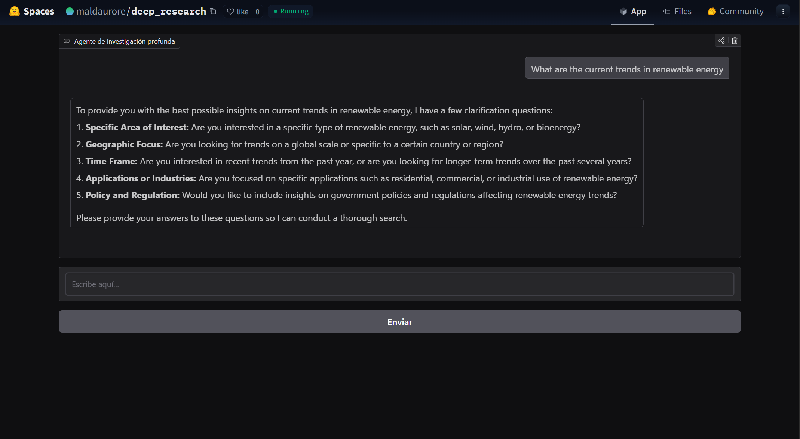
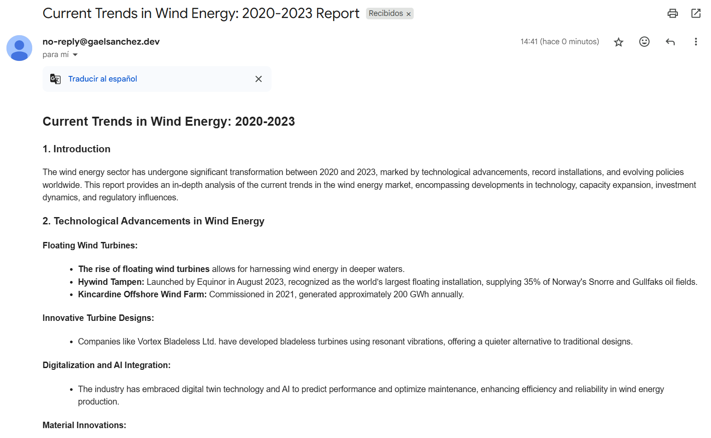

# 🧠 Deep Research Agent (Modular)

A modular and interactive AI research assistant built with the OpenAI Assistants API and Gradio.

Instead of running the entire research process in a single call, this system breaks it down into reusable **tool-based stages**, all orchestrated by a central **Research Manager Agent**. This architecture enables a more natural, conversational, and step-by-step user experience — similar to tools like ChatGPT, but tailored for deep research workflows.

---

## ✨ Key Features

- 🔧 **Modular Tools** — Each research phase is implemented as an independent tool, following a clean and extensible architecture.
- 🧠 **Research Manager Agent** — Acts as a coordinator, guiding the user through the research steps and calling tools as needed.
- 📬 **Dynamic Email Sending** — The agent asks the user for their email and sends a nicely formatted report using SendGrid, avoiding hardcoded sender logic.
- 💬 **Interactive UX** — The flow feels like a real conversation, allowing users to go deep, reflect, and adjust as they go.

---

## 📚 What I Built

I extended the original project of Ed Donner's Agentic AI Course by:

- Refactoring the monolithic agent into a tool-based system.
- Designing a clean orchestration layer with a manager agent.
- Improving UX with a more fluid, step-by-step interaction.
- Adding dynamic email handling with environment variables and domain verification via SendGrid.

---

## 💼 Tech Stack

- Python
- OpenAI SDK
- Gradio
- SendGrid

---

## ⚙️ Environment Setup

> For security, sensitive data like your OpenAI and SendGrid keys are stored in a `.env` file. See `.env.example` for guidance.

---

## 🧪 Try It

You can run this locally, or try the interactive version on [Hugging Face Spaces](https://huggingface.co/spaces/maldaurore/deep_research).

---

## 🚀 Demo Screenshots

 

---

## 📩 Contact

Feel free to reach out: [gahasadu@gmail.com](mailto:gahasadu@gmail.com)

---

## 📝 License

MIT License — use it, learn from it, build on it.
